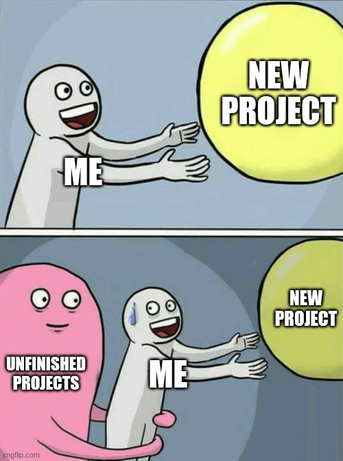

<div align="center">
  <br>
  <h1 style="margin-top: 10px; margin-bottom: 5px;">tohum</h1>
  <p style="margin-top: 0;"><em>A CLI tool for provisioning projects from templates</em></p>
</div>


[](https://github.com/mkaramuk/tohum/issues)

[](https://github.com/TheBSD/StandWithPalestine/blob/main/docs/README.md)


<hr />

"tohum" (/toˈhuːm/, which means "seed" in Turkish) is a CLI tool that you can use to initialize your new projects from a pre-defined templates that you've chosen. You can also implement your own templates to extend the functionality.

> ⚠️ **WARNING** ⚠️
>
> tohum is in its early stage of development, expect breaking changes.

## Installation

### Dependencies

- [git](https://git-scm.com/)
- [openssl](https://github.com/openssl/openssl)

### cargo

Currently tohum is only published on cargo registry which means you can simply use cargo to install it:

```sh
cargo install tohum
```

### NixOS

Since it is too early, we haven't attempt to add tohum to nixpkgs but there is a flake defined in the root of the repository which allow you to run, build or include tohum in your own flakes or system configuration.

### Build from source

Another option (actually this is not super different from installing from cargo) is building from the source code. For this option you must have Rust toolchain. You can install it by simply using [rustup](https://rustup.rs/).

```shell
git clone https://github.com/mkaramuk/tohum.git && cd tohum
cargo build --release
sudo ./install.sh # This installs the binary to `/usr/local/bin/tohum`
```

## Quickstart

"Store" is the concept that includes all the available templates that can be used with tohum. It is a simple directory that contains some templates and a `store.json` file which includes the metadata about the Store. tohum currently only supports using the default Store which lives in this repository (check the `templates` directory).

Let's list the all the templates from the default Store:

```sh
$ tohum store list

📦 Available templates from Store https://raw.githubusercontent.com/mkaramuk/tohum/main/templates/store.json:

  📝 go/cli
     Go CLI application template with basic setup.

  📝 node/cli/ts
     Node.js project TypeScript included. This template uses tsup as the bundler.

  📝 node/react
     React project with TypeScript and Vite setup. This template uses tsup as the bundler.
```

Now we know what are the available templates that we can use. Pick one and initialize a new project. For example:

```sh
$ tohum init node/cli/ts my-super-cli-project
🎉 Project 'my-super-cli-project' successfully initialized!
📝 Template: node/cli/ts
📁 Location: my-super-cli-project
```

Congratulations! You've provisioned your first project using _tohum_!

## Building templates

TODO: Write me!

## Contributing

We are open for all type of contributions including translations, adding and maintaining templates, feature implementations and bug fixings.
